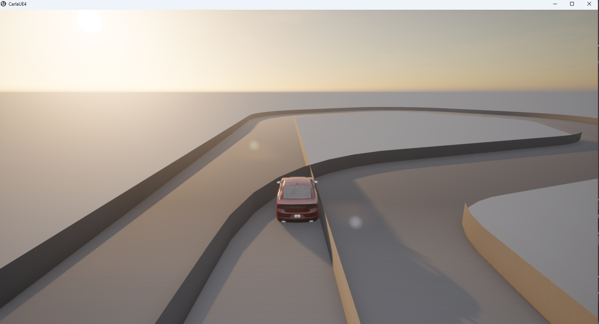
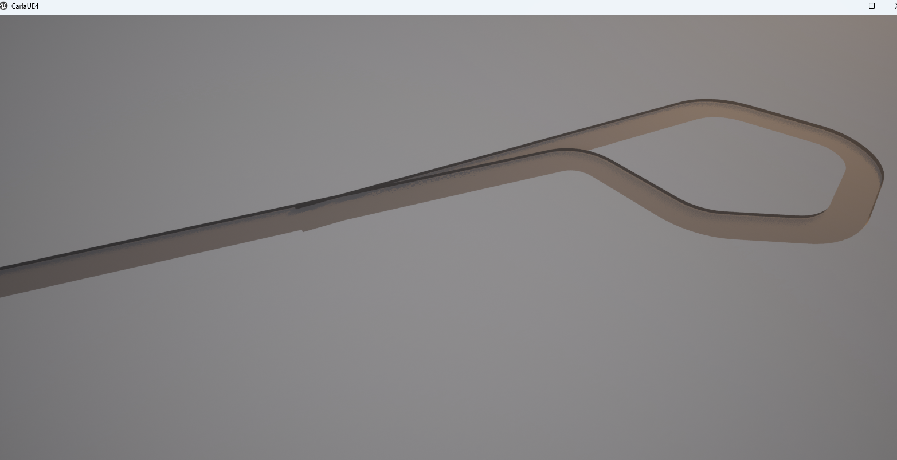

# AutoDrive Environment Designer

## CARLA 기반 단계형 자율주행 환경 설계 및 반복 평가 시스템 개발 보고서

- 학번: `2024111344`
- 이름: `김일래`
- 작성일: `2026-04-09`
- 문서 상태: `최종 개발 보고서 정리본`

---

## 1. 프로젝트 개요

본 프로젝트의 목적은 자율주행 알고리즘 자체를 직접 개발하는 것이 아니라, 자율주행 알고리즘을 반복적으로 시험하고 평가할 수 있는 **주행 환경 설계 및 반복 평가 도구**를 구현하는 데 있다. 이를 위해 CARLA 시뮬레이터와 OpenDRIVE 기반 도로 기술 방식을 이용하여, 주행 가능한 환경을 자동으로 준비하고, 차량을 스폰하여 주행을 수행한 뒤, 결과를 평가하고, 그 결과를 바탕으로 다음 환경을 다시 설계하는 반복 구조를 구성하였다.

기존의 많은 자율주행 연구는 인식, 경로 계획, 제어와 같은 핵심 알고리즘에 집중하는 경우가 많다. 그러나 실제 검증 단계에서는 어떤 환경을 어떤 순서로 제공할 것인지, 이전 결과를 다음 시험 환경에 어떻게 반영할 것인지, 그리고 사용자가 환경 생성과 실행 과정을 얼마나 쉽게 제어할 수 있는지가 매우 중요하다. 본 프로젝트는 이러한 문제를 해결하기 위해 **환경 생성-실행-평가-재생성 루프**를 하나의 응용 프로그램으로 통합하는 것을 목표로 하였다.

본 시스템은 다음의 세 단계 구조를 중심으로 동작한다.

1. `Track Stage`
2. `Intermediate Road Stage`
3. `Practical Road Stage`

이 세 단계는 단순한 폐쇄형 트랙에서 시작하여, 차선 유지가 중요한 road-like 코스를 거쳐, 최종적으로는 CARLA 기본 Town 맵 기반 시나리오까지 확장되는 구조로 설계되었다.

---

## 2. 개발 배경 및 필요성

자율주행 알고리즘의 성능은 단일 환경에서 한 번 측정한 결과만으로 평가하기 어렵다. 단순한 직선 코스에서는 안정적이던 알고리즘도, 곡선이 많은 코스나 교통량이 있는 도심 환경에서는 쉽게 약점이 드러날 수 있다. 따라서 자율주행 검증에는 다음과 같은 기능이 필요하다.

- 다양한 난이도의 환경을 반복적으로 준비하는 기능
- 이전 주행 결과를 바탕으로 다음 환경을 자동 조정하는 기능
- 사용자가 필요에 따라 일부 환경 조건을 직접 고정하는 기능
- 주행 결과를 일관된 형식으로 저장하고 비교하는 기능

본 프로젝트는 이러한 필요를 충족하기 위해, 단순한 데모 스크립트가 아니라 **환경 생성과 평가를 중심으로 한 실험용 프레임워크**를 구현하고자 하였다.

특히 본 프로젝트는 다음과 같은 현실적인 방향을 선택하였다.

- `Track` 및 `Intermediate` 단계에서는 generated OpenDRIVE 맵을 사용한다.
- `Practical` 단계에서는 CARLA 기본 Town 맵을 활용하여, 생성형 맵 에디터가 아니라 **Town 기반 scenario generator** 방향으로 확장한다.

이 선택은 CARLA 기본 Town 수준의 시각 품질을 직접 재현하는 것보다, 이미 완성도 높은 Town 자산을 활용하여 실질적인 실험 완성도를 높이는 것이 더 현실적이라는 판단에 근거한다.

---

## 3. 개발 목표

본 프로젝트의 세부 목표는 다음과 같다.

1. OpenDRIVE 기반 주행 코스를 자동 생성할 수 있어야 한다.
2. 생성된 맵을 CARLA에 로드하고 ego vehicle을 스폰할 수 있어야 한다.
3. 수동 주행 또는 외부 주행 코드가 환경 위에서 동작할 수 있어야 한다.
4. 주행 결과를 정량적으로 평가하고 JSON으로 저장할 수 있어야 한다.
5. 저장된 결과를 바탕으로 다음 환경을 자동 생성할 수 있어야 한다.
6. 사용자가 GUI를 통해 전체 흐름을 제어할 수 있어야 한다.
7. Track -> Intermediate -> Practical로 이어지는 단계형 검증 구조를 제공해야 한다.

---

## 4. 개발 범위와 제외 범위

### 4.1 개발 범위

본 프로젝트에서 직접 구현한 범위는 다음과 같다.

- OpenDRIVE 맵 생성
- generated XODR 맵의 CARLA 로드
- Town 기반 scenario JSON 생성
- ego vehicle 스폰 및 lifecycle 관리
- background traffic 및 pedestrian baseline 스폰
- finish line 및 destination 기반 평가
- lane discipline, wrong-lane, offroad, collision, completion 등의 결과 계산
- 결과 기반 다음 환경 자동 조정
- tkinter 기반 상위 제어 GUI
- Windows 실행 파일 및 설치 파일 패키징

### 4.2 제외 범위

본 프로젝트는 다음 항목을 직접 구현 대상으로 두지 않았다.

- 자율주행 인식 모델 개발
- 차선 인식, 객체 인식, 경로 계획 알고리즘 개발
- 실제 차량 제어기 개발
- CARLA 기본 Town 수준의 신규 맵 자산 제작
- Unreal Editor 기반 고급 도로 데칼/에셋 제작

즉, 본 프로젝트의 핵심은 **자율주행 알고리즘 자체**가 아니라, **검증 환경을 단계적으로 생성하고 반복 평가하는 시스템**에 있다.

---

## 5. 전체 시스템 구조

시스템은 크게 네 개의 계층으로 구성된다.

1. 환경 생성 계층
2. CARLA 실행 계층
3. 평가 계층
4. GUI 제어 계층

전체 흐름은 다음과 같다.

```text
이전 결과 선택 또는 새 stage 선택
    -> 환경 생성 또는 시나리오 생성
    -> CARLA 로드
    -> ego vehicle / background actor 준비
    -> 수동 또는 외부 주행
    -> 평가 및 JSON 저장
    -> 다음 환경 생성 입력으로 재사용
```

### 5.1 Track / Intermediate 구조

Track와 Intermediate에서는 generated OpenDRIVE `.xodr` 파일이 직접 생성된다. 이 파일은 CARLA에 로드되고, 생성된 도로 위에 차량이 스폰되며, finish line까지 주행한 결과가 평가된다.

### 5.2 Practical 구조

Practical에서는 새로운 `.xodr`를 만드는 대신, CARLA 기본 Town 맵 위에서 동작하는 scenario JSON을 생성한다. 여기에는 다음 정보가 포함된다.

- Town ID
- Weather preset
- Traffic preset
- Route preset
- spawn / destination
- route length hint
- junction focus
- vehicle / pedestrian count

이 구조를 통해 Practical 단계는 generated map이 아니라 **generated scenario** 중심으로 동작한다.

### 5.3 generated 맵 생성 논리

본 프로젝트의 핵심은 단순히 임의의 도로를 랜덤하게 뽑는 것이 아니라, **이전 주행 결과를 해석하여 다음 환경의 구조를 논리적으로 결정하는 것**에 있다. Track과 Intermediate 단계에서는 이 논리가 generated OpenDRIVE 맵 생성기로 구현되어 있다.

생성 절차는 다음 순서로 정리할 수 있다.

1. 이전 결과 JSON에서 현재 맵의 수행 결과를 읽는다.
2. 이전 맵의 `generation_level` 또는 manifest의 `level` 값을 찾아 현재 난이도 기준점을 복원한다.
3. `completion`, `path_tracking_score`, `finish 도달 여부`, `offroad`, `collision`, `lane discipline` 등을 이용해 하나의 `driving_score`를 계산한다.
4. 이 점수를 바탕으로 다음 난이도 `next_level`을 계산한다.
5. 난이도는 다시 `course stage`와 `variant`로 해석된다.
6. stage 규칙에 따라 총 길이, 곡선 수, 방향 전환 수, recovery 직선 길이, 곡률 강도를 결정한다.
7. 마지막으로 validation을 수행하여 비정상 레이아웃을 탈락시키고, 정상적인 `.xodr`와 manifest를 저장한다.

즉 generated 맵은 “무작위 도로”가 아니라, **이전 결과를 입력으로 하는 적응형 코스 생성 결과물**이다.

Track/Intermediate 공통 생성 로직의 핵심 구현 파일은 다음과 같다.

- [scripts/app/auto_generation.py](C:/Users/user/Documents/Codex_Workspace/AutoDriveEnvironmentDesigner/scripts/app/auto_generation.py)
- [scripts/map_generator/course_stages.py](C:/Users/user/Documents/Codex_Workspace/AutoDriveEnvironmentDesigner/scripts/map_generator/course_stages.py)
- [scripts/map_generator/course_composer.py](C:/Users/user/Documents/Codex_Workspace/AutoDriveEnvironmentDesigner/scripts/map_generator/course_composer.py)
- [scripts/map_generator/course_validation.py](C:/Users/user/Documents/Codex_Workspace/AutoDriveEnvironmentDesigner/scripts/map_generator/course_validation.py)
- [scripts/map_generator/level_generator.py](C:/Users/user/Documents/Codex_Workspace/AutoDriveEnvironmentDesigner/scripts/map_generator/level_generator.py)

먼저 `auto_generation.py`는 이전 결과에서 현재 난이도를 복원하고, 결과를 단일 `driving_score`로 요약한 뒤, `update_difficulty()`를 호출해 다음 난이도를 계산한다. 여기서 중요한 점은 변화량이 고정이 아니라 점수 크기에 따라 달라진다는 것이다. 성공률이 매우 높으면 더 큰 폭으로 난이도를 올리고, 실패가 심하면 더 큰 폭으로 난이도를 내린다.

그 다음 `course_stages.py`는 연속적인 level 값을 사람이 이해할 수 있는 macro stage로 바꾼다. 예를 들어 `foundation_flow`, `offset_transition`, `curvy_medium`, `technical_hard`, `mixed_extreme`와 같은 stage가 정의되어 있으며, 각 stage는 다음과 같은 목표 범위를 가진다.

- 목표 총 길이 구간
- 목표 곡선 수 구간
- 목표 방향 전환 수 구간
- recovery 직선 비율 구간
- 곡률 스케일 범위
- 회전 각도 보정 범위

즉 난이도 값 하나를 바로 도로로 바꾸는 것이 아니라, 먼저 “어떤 성격의 코스를 만들어야 하는가”라는 stage 정의로 해석하는 구조이다.

`course_composer.py`는 이 stage 정의를 실제 segment 조합으로 바꾼다. composer는 단순히 variant 이름만 고르는 것이 아니라, stage와 layout seed를 기반으로 다음 목표값을 계산한다.

- `target_total_length_m`
- `target_curve_count`
- `target_direction_reversals`
- `recovery_length_budget_m`
- `curvature_scale`
- `turn_angle_boost`

이 값들을 기반으로 `single_turn`, `gentle_chicane`, `offset_bend`, `s_curve`, `compound_turn`, `switchback`, `double_apex`, `snake_run`과 같은 motif를 조합한다. 이후 `_augment_curve_density()`로 곡선 수를 보강하고, `_rebalance_line_lengths()`와 `_align_recovery_budget()`로 직선 길이와 recovery 비율을 stage 의도에 맞게 다시 조정한다.

이 설계가 중요한 이유는, 같은 variant라도 항상 비슷한 모양이 반복되지 않고, **길이/곡선 수/방향 전환/회복 구간이 함께 조절되는 실제 적응형 코스**가 만들어지기 때문이다.

Intermediate Stage도 같은 철학을 공유하지만, 생성 목표가 Track과 다르다. Track은 곡선 대응과 finish 검증이 중심이고, Intermediate는 road-like한 양방향 도로 구조와 차선 중심 평가가 더 중요하다. 따라서 generated XODR 자체는 여전히 생성형이지만, manifest에는 `training_stage=intermediate`, `traffic_side=right`, `evaluation_target_mode=lane_center_guidance`가 기록되며, 도로폭/차선/shoulder 규칙도 Intermediate 목적에 맞게 달라진다.

또한 본 프로젝트에서는 generated 코스가 stage 의도에 맞는지 검증하는 validation 계층을 별도로 두었다. 길이, 곡선 수, 방향 전환 수, recovery 비율뿐 아니라, 비인접 구간이 지나치게 가까워지는 경우를 걸러내는 `minimum nonlocal clearance` 검사도 추가하였다. 이 검사는 난이도를 낮추는 것이 아니라, **시연 안정성을 해치는 비정상 레이아웃만 제거하는 안전장치**라는 점에서 의미가 있다.

### 5.4 평가 로직과 결과 기반 적응 논리

본 프로젝트의 또 다른 핵심은 “주행을 어떻게 평가할 것인가”이다. 자율주행 검증에서는 단순히 완주 여부만 보는 것으로는 충분하지 않다. 차선 중심을 얼마나 잘 유지했는지, 도로 밖으로 얼마나 벗어났는지, 충돌이 있었는지, goal이나 finish까지 얼마나 안정적으로 도달했는지를 함께 반영해야 한다.

이를 위해 본 프로젝트는 **raw metric**과 **실사용 score**를 분리하였다.

- raw metric
  - 엄격한 ideal line 일치도
  - 샘플별 lateral error
  - lane departure ratio
  - opposite lane ratio
- 실사용 score
  - 생성기와 GUI가 사용하는 완만한 종합 점수

이 분리가 필요한 이유는, 수동 주행이나 외부 주행 코드를 검증할 때 ideal line에서 조금만 벗어나도 무조건 낮은 점수가 나오는 것은 현실적이지 않기 때문이다. 따라서 raw 값은 그대로 저장하되, 실제 다음 환경을 조정할 때는 보다 완만한 `path_tracking_score`와 `lane_discipline_score`를 사용하는 구조를 채택하였다.

실사용 driving score의 기본 골격은 다음과 같다.

```text
score
  = 0.45 * completion_ratio
  + 0.35 * path_tracking_score
  + 0.20 * finish_or_goal_bonus
```

이 기본 점수에 다음 패널티를 곱하는 방식으로 최종 점수를 계산한다.

- offroad 비율이 높을수록 감점
- lane discipline이 낮을수록 감점
- lane departure 비율이 높을수록 감점
- opposite lane 비율이 높을수록 감점
- collision이 있으면 큰 폭 감점
- `course_departure`, `not_finished` 같은 실패 유형에도 감점

반대로 성공적으로 finish 또는 destination까지 도달한 경우에는 점수가 너무 낮아지지 않도록 하한을 두어, “완주는 했지만 약간 흔들린 경우”와 “실패한 경우”가 명확히 구분되도록 설계하였다.

`path_tracking_score`와 `lane_discipline_score`는 모두 샘플별 lateral error를 이용한 soft score지만, 두 값의 용도는 다르다.

- `path_tracking_score`
  - 도로 또는 기준 경로를 얼마나 부드럽게 따라갔는지 평가
- `lane_discipline_score`
  - 자기 차선 중심을 얼마나 잘 유지했는지 더 엄격하게 평가

둘 다 샘플당 `1 / (1 + normalized_error^2)` 형태의 점수를 사용하지만, lane discipline 쪽이 더 작은 허용 범위를 사용하므로, 같은 흔들림이라도 차선 유지 성능에는 더 엄격한 평가가 적용된다.

이 점수는 단순 표시용이 아니라, **다음 환경을 어떻게 바꿀지 결정하는 제어 신호**로 사용된다.

Track/Intermediate 단계의 경우:

- 충돌이 있으면 난이도를 낮추고 쉬운 variant 쪽으로 이동
- course departure나 stability 문제가 있으면 recovery 직선이 더 많은 쪽으로 이동
- 높은 score와 안정적인 finish가 반복되면 더 높은 stage로 이동
- stage가 올라갈수록 총 길이, 곡선 수, 방향 전환 수, 곡률 밀도가 증가

Practical 단계의 경우:

- collision이 있으면 traffic, pedestrian, route length를 줄이고 junction focus를 낮춘다
- completion이 지나치게 낮으면 route 길이와 교통량을 낮춘다
- course departure나 wrong-lane이 심하면 lane 안정성을 우선하는 방향으로 완화한다
- score가 높고 destination에 안정적으로 도달하면 traffic, pedestrian, route length를 늘리고 junction focus를 높인다
- 사용자가 설정창에서 직접 입력한 값은 해당 필드만 override하고, 나머지는 자동 적응 로직이 계속 담당한다

즉 본 프로젝트의 핵심은 “결과를 저장한다”가 아니라, **저장된 결과를 다음 환경 설계 규칙의 입력으로 다시 사용한다는 점**이다. 이 때문에 generated Track과 Town scenario가 각각 다른 형태를 가지더라도, 두 단계 모두 동일한 철학, 즉 `평가 -> 적응 -> 다음 환경 생성`이라는 공통 논리를 공유한다.

---

## 6. 디렉터리 및 핵심 파일 구조

프로젝트의 주요 디렉터리는 다음과 같다.

```text
AutoDriveEnvironmentDesigner/
├─ docs/
│  ├─ progress_notes/
│  ├─ report_notes/
│  └─ screenshots/
├─ examples/
│  └─ integration/
├─ experiments/
│  └─ practical/
├─ maps/
│  └─ generated/
├─ packaging/
│  └─ windows/
├─ output/
│  ├─ doc/
│  └─ release/
├─ results/
│  ├─ manual_sequence/
│  └─ practical/
├─ scenarios/
│  └─ practical/
└─ scripts/
   ├─ app/
   ├─ carla_runner/
   ├─ evaluation/
   └─ map_generator/
```

### 6.1 `scripts/app/`

상위 응용 프로그램 계층이다.

- [gui.py](C:/Users/user/Documents/Codex_Workspace/AutoDriveEnvironmentDesigner/scripts/app/gui.py)
  - tkinter 기반 메인 제어 패널
  - stage 전환, 결과 목록, 생성/실행 버튼, Practical 설정창 등을 담당
- [launcher.py](C:/Users/user/Documents/Codex_Workspace/AutoDriveEnvironmentDesigner/scripts/app/launcher.py)
  - GUI에서 선택한 옵션을 실제 runner 호출로 연결하는 진입점
- [auto_generation.py](C:/Users/user/Documents/Codex_Workspace/AutoDriveEnvironmentDesigner/scripts/app/auto_generation.py)
  - Track / Intermediate 단계의 결과 기반 다음 맵 생성 로직
- [practical_stage.py](C:/Users/user/Documents/Codex_Workspace/AutoDriveEnvironmentDesigner/scripts/app/practical_stage.py)
  - Practical preset, custom override, adaptation 파라미터 관리
- [practical_scenario_generation.py](C:/Users/user/Documents/Codex_Workspace/AutoDriveEnvironmentDesigner/scripts/app/practical_scenario_generation.py)
  - Town 기반 scenario JSON/manifest 생성

### 6.2 `scripts/map_generator/`

generated XODR 생성 계층이다.

- [level_generator.py](C:/Users/user/Documents/Codex_Workspace/AutoDriveEnvironmentDesigner/scripts/map_generator/level_generator.py)
  - stage 및 level에 맞는 도로 구성 생성
- [course_composer.py](C:/Users/user/Documents/Codex_Workspace/AutoDriveEnvironmentDesigner/scripts/map_generator/course_composer.py)
  - segment 조합 기반 코스 생성
- [course_stages.py](C:/Users/user/Documents/Codex_Workspace/AutoDriveEnvironmentDesigner/scripts/map_generator/course_stages.py)
  - stage별 길이, 곡선 수, recovery 비율 등의 규칙 정의
- [course_validation.py](C:/Users/user/Documents/Codex_Workspace/AutoDriveEnvironmentDesigner/scripts/map_generator/course_validation.py)
  - 생성 결과의 signature와 validation 계산
- [track_contract.py](C:/Users/user/Documents/Codex_Workspace/AutoDriveEnvironmentDesigner/scripts/map_generator/track_contract.py)
  - spawn point, finish line 계약 정의

### 6.3 `scripts/carla_runner/`

CARLA 실제 실행 계층이다.

- [run_manual_xodr_demo.py](C:/Users/user/Documents/Codex_Workspace/AutoDriveEnvironmentDesigner/scripts/carla_runner/run_manual_xodr_demo.py)
  - generated XODR 단일 맵 주행
- [run_manual_map_sequence_demo.py](C:/Users/user/Documents/Codex_Workspace/AutoDriveEnvironmentDesigner/scripts/carla_runner/run_manual_map_sequence_demo.py)
  - 여러 generated 맵을 이어서 검증
- [run_practical_scenario_demo.py](C:/Users/user/Documents/Codex_Workspace/AutoDriveEnvironmentDesigner/scripts/carla_runner/run_practical_scenario_demo.py)
  - Town 기반 Practical scenario 실행
- [load_xodr_in_carla.py](C:/Users/user/Documents/Codex_Workspace/AutoDriveEnvironmentDesigner/scripts/carla_runner/load_xodr_in_carla.py)
  - generated OpenDRIVE 맵 로드
- [load_town_in_carla.py](C:/Users/user/Documents/Codex_Workspace/AutoDriveEnvironmentDesigner/scripts/carla_runner/load_town_in_carla.py)
  - Town 로드
- [vehicle_utils.py](C:/Users/user/Documents/Codex_Workspace/AutoDriveEnvironmentDesigner/scripts/carla_runner/vehicle_utils.py)
  - ego vehicle, traffic, pedestrian 스폰 및 정리
- [integration_loader.py](C:/Users/user/Documents/Codex_Workspace/AutoDriveEnvironmentDesigner/scripts/carla_runner/integration_loader.py)
  - vehicle config 파일과 driver module 파일을 읽어 사용자 설정을 로딩
- [external_driver_runtime.py](C:/Users/user/Documents/Codex_Workspace/AutoDriveEnvironmentDesigner/scripts/carla_runner/external_driver_runtime.py)
  - 외부 주행 코드 프로세스 실행과 종료 lifecycle 관리
- [post_run_review.py](C:/Users/user/Documents/Codex_Workspace/AutoDriveEnvironmentDesigner/scripts/carla_runner/post_run_review.py)
  - finish/goal 이후 결과 비교표와 다음 조정 미리보기 패널 생성

### 6.4 `scripts/evaluation/`

평가 계층이다.

- [path_metrics.py](C:/Users/user/Documents/Codex_Workspace/AutoDriveEnvironmentDesigner/scripts/evaluation/path_metrics.py)
  - path match, path tracking, lane discipline, offroad, completion 계산
- [scoring.py](C:/Users/user/Documents/Codex_Workspace/AutoDriveEnvironmentDesigner/scripts/evaluation/scoring.py)
  - 실사용 score 계산
- [result_models.py](C:/Users/user/Documents/Codex_Workspace/AutoDriveEnvironmentDesigner/scripts/evaluation/result_models.py)
  - 결과 JSON 모델과 저장/로딩

### 6.5 `examples/integration/`

외부 차량 및 주행 코드 연동을 빠르게 검증하기 위한 예제 파일을 두었다.

- [sample_vehicle_blue_charger.json](C:/Users/user/Documents/Codex_Workspace/AutoDriveEnvironmentDesigner/examples/integration/sample_vehicle_blue_charger.json)
  - 기본 차량 색상 변경 vehicle config 예제
- [sample_vehicle_tesla_blue.json](C:/Users/user/Documents/Codex_Workspace/AutoDriveEnvironmentDesigner/examples/integration/sample_vehicle_tesla_blue.json)
  - Tesla Model 3를 사용하는 vehicle config 예제
- [sample_driver_uhjk.py](C:/Users/user/Documents/Codex_Workspace/AutoDriveEnvironmentDesigner/examples/integration/sample_driver_uhjk.py)
  - 기본 WASD 대신 `U/H/J/K` 키맵을 사용하는 driver module 예제

### 6.6 `packaging/windows/` 및 `output/release/`

배포와 실행 파일 생성을 위한 패키징 계층이다.

- [build_windows_bundle.ps1](C:/Users/user/Documents/Codex_Workspace/AutoDriveEnvironmentDesigner/packaging/windows/build_windows_bundle.ps1)
  - PyInstaller 번들과 Inno Setup 설치 파일 생성
- [build_windows_release_assets.ps1](C:/Users/user/Documents/Codex_Workspace/AutoDriveEnvironmentDesigner/packaging/windows/build_windows_release_assets.ps1)
  - GitHub Release 업로드용 setup/portable 자산 생성
- [AutoDriveEnvironmentDesigner.spec](C:/Users/user/Documents/Codex_Workspace/AutoDriveEnvironmentDesigner/packaging/windows/AutoDriveEnvironmentDesigner.spec)
  - Windows 실행 파일 빌드 설정
- [AutoDriveEnvironmentDesigner.iss](C:/Users/user/Documents/Codex_Workspace/AutoDriveEnvironmentDesigner/packaging/windows/AutoDriveEnvironmentDesigner.iss)
  - 설치 파일 생성용 Inno Setup 스크립트
- [output/release/](C:/Users/user/Documents/Codex_Workspace/AutoDriveEnvironmentDesigner/output/release)
  - setup 실행 파일과 portable zip 산출물

---

## 7. 단계별 구현 내용

## 7.1 Track Stage

Track Stage는 generated OpenDRIVE 기반 폐쇄형 또는 단순 코스 검증 단계이다. 사용자는 결과 리스트에서 이전 결과를 선택하고, `Generate + Drive Next Map`을 실행하여 다음 맵을 자동 생성한 뒤 곧바로 주행할 수 있다.

Track Stage에서 구현된 핵심 기능은 다음과 같다.

- OpenDRIVE 맵 자동 생성
- CARLA OpenDRIVE 로드
- 차량 스폰 및 수동 주행
- finish line 기반 평가
- 주행 결과 JSON 저장
- 결과 기반 다음 맵 생성
- finish 이후 `1: 결과 비교표`, `2: 다음 조정 미리보기` 리뷰 패널 제공

Track Stage는 기본 제어, 곡선 대응, finish 통과, path 추종 안정성 등을 빠르게 확인하기 위한 단계로 사용된다.


그림 1은 Track Stage가 선택된 메인 제어 패널이다. 왼쪽에는 runtime, stage 선택, XODR 실행과 generation loop가 배치되어 있고, 오른쪽에는 session summary, 결과 목록, process log가 배치되어 있다.


그림 2는 Track Stage에서 생성된 코스를 CARLA 상공 시점으로 확인한 장면이다.


그림 3은 finish line 통과 직후 점수 카드가 표시되는 장면이다. 이 화면에서는 점수, 성공 여부, completion, path/lane score, offroad, collision 정보를 즉시 확인할 수 있다.

## 7.2 Intermediate Road Stage

Intermediate Stage는 Track Stage의 다음 단계로, 단순한 트랙보다 road-like한 generated XODR 환경을 제공한다. 이 단계의 핵심은 단순 완주가 아니라 **차선 중심 주행과 lane discipline**이다.

Intermediate Stage의 주요 특징은 다음과 같다.

- 더 긴 road-like generated 코스
- lane-centered guidance 기반 평가
- lane discipline score 계산
- lane departure 및 wrong-lane 비율 계산
- 보다 강한 offroad penalty 적용


그림 4는 Intermediate Stage가 선택된 메인 제어 패널이다. Track Stage와 유사한 흐름을 유지하면서도, road-like course와 lane-oriented evaluation이 현재 stage 설명에 반영되는 것을 확인할 수 있다.


그림 5는 Intermediate Stage에서 생성된 road-like 코스의 상공 시점이다. Track Stage보다 길고, 차선 중심 주행이 중요한 구조로 확장된 것을 확인할 수 있다.


그림 6은 Intermediate Stage에서 finish line 통과 후 표시되는 점수 카드이다. Track Stage에 비해 lane discipline, raw path match, lane departure, wrong-lane과 같은 road-driving 지표가 보다 중요하게 반영된다.

## 7.3 Practical Road Stage

Practical Stage는 generated XODR가 아니라 CARLA 기본 Town 맵 기반 시나리오 검증 단계이다. 이 단계에서는 Town, weather, traffic, route preset을 고르고, 필요하면 custom settings로 일부 조건만 직접 고정한 뒤, destination까지 주행하여 결과를 평가한다.

Practical Stage의 핵심 기능은 다음과 같다.

- Town 기반 scenario 생성
- auto adaptation과 field-level custom override 동시 지원
- ego vehicle, background traffic, pedestrian baseline 실행
- goal marker와 route guidance HUD 제공
- destination reached 기반 score 계산
- 결과를 바탕으로 다음 scenario 자동 조정
- goal 이후 최근 결과 비교와 다음 scenario 조정 미리보기 제공


그림 7은 Practical Stage가 선택된 메인 GUI이다. Track/Intermediate와 달리 Town, Weather, Traffic, Route 설정이 중심이 되며, Practical scenario 생성 및 실행 버튼이 제공된다.


그림 8은 Practical custom settings 팝업이다. 사용자는 vehicle count, pedestrian count, route length, junction focus를 직접 지정할 수 있으며, 비워 둔 필드는 자동 적응 값을 그대로 사용하도록 설계하였다.


그림 9는 Town 기반 Practical 주행 장면이다. GOAL marker와 route guidance HUD를 통해 목적지 방향과 남은 경로를 시각적으로 확인할 수 있다.


그림 10은 Practical Stage에서 destination에 도달한 뒤 평가 카드가 표시되는 장면이다. Town 주행 결과에 대해 completion, lane, offroad, collision, wrong-lane 등의 지표가 종합적으로 계산된다.

## 7.4 차량 모델 및 주행 코드 연동 기능

본 프로젝트는 기본적으로 CARLA 내장 차량과 수동 주행을 기본값으로 사용하지만, 실제 검증 도구로 활용하려면 사용자가 자신의 차량 설정과 주행 로직을 연결할 수 있어야 한다. 이를 위해 GUI에 `Vehicle / Driver Integration Settings` 팝업을 추가하여, 차량 설정과 driver 설정을 각각 독립적으로 불러올 수 있도록 하였다.

지원하는 방식은 다음과 같다.

- `Vehicle Config File`
  - blueprint id, color, role_name 등을 JSON으로 지정한다.
  - 차량만 교체하고 주행 방식은 기본 수동 주행으로 유지할 수 있다.
- `Driver Module File`
  - 사용자가 준비한 Python driver module을 직접 불러온다.
  - 차량은 기본값으로 유지하고 주행 방식만 교체할 수 있다.
- `External Launch Command`
  - 외부 실행 명령을 등록하여 별도의 주행 프로그램이나 향후 ROS bridge 연동 구조와 연결할 수 있다.

이 구조를 통해 사용자는 다음 조합을 모두 사용할 수 있다.

1. 기본 차량 + 기본 수동 주행
2. 사용자 차량 설정 + 기본 수동 주행
3. 기본 차량 + 사용자 driver module
4. 사용자 차량 설정 + 사용자 driver module

현재 프로토타입에서는 앱이 여전히 맵/Town 로드, ego 차량 스폰, 평가, 결과 저장을 담당하며, 외부 주행 코드는 앱이 만든 ego actor에 붙어 제어하는 구조를 기본으로 한다. 이를 통해 “환경 생성 및 평가 오케스트레이터”라는 본 프로젝트의 역할을 유지하면서도, 외부 차량/주행 코드와의 연결 가능성을 실질적으로 확보하였다.


그림 10-1은 Vehicle / Driver Integration Settings 팝업이다. 사용자는 vehicle config 파일과 driver module 파일을 각각 독립적으로 불러와 차량 모델과 주행 방식을 조합할 수 있으며, 필요할 경우 외부 실행 명령 기반 연동도 설정할 수 있다.

## 7.5 배포 및 실행 파일 구성

프로토타입은 개발 환경에서 Python 스크립트로 실행할 수 있을 뿐 아니라, Windows 실행 파일과 설치 파일 형태로도 패키징하였다. 이를 통해 CARLA와 PythonAPI 경로만 준비되면, 별도의 소스 실행 없이도 프로그램을 직접 설치하여 사용할 수 있다.

구성한 배포 형태는 다음과 같다.

- 단일 실행 파일 기반 Windows 번들
- Inno Setup 기반 설치 파일
- GitHub Release 업로드용 portable zip

패키징 과정에서는 다음 사항을 함께 반영하였다.

- 배포판이 자기 자신을 다시 호출해 하위 launcher 작업을 실행할 수 있도록 진입점 정리
- 설치 폴더가 아니라 사용자 문서 폴더 아래 런타임 작업공간을 사용하도록 경로 분리
- Track Stage 첫 실행 시 결과 JSON이 없어도 seed map을 생성하도록 fallback 추가
- Practical Stage에서 scenario 파일이 비어 있어도 자동 생성 후 즉시 실행되도록 보완

이를 통해 본 프로젝트는 “코드 저장소” 수준을 넘어, 실제 시연 가능한 배포형 프로토타입으로 확장되었다.

---

## 8. 평가 방식

평가 방식은 stage에 따라 기준이 조금씩 다르게 적용된다.

### 8.1 Track Stage 평가

- completion ratio
- path tracking score
- raw path match score
- offroad ratio
- collision count
- finish line 도달 여부

Track Stage에서는 “코스를 끝까지 통과할 수 있는가”가 가장 중요한 기준이다. 따라서 finish line 도달 여부와 completion ratio의 비중이 높다. 다만 완주만으로 충분하지 않으므로, path tracking score를 함께 사용하여 지나치게 흔들리는 주행과 안정적인 주행을 구분하였다. raw path match score는 더 엄격한 ideal line 일치도를 나타내는 참고 지표로 유지하되, 실제 점수 계산에서는 보다 완만한 tracking score를 사용하여 수동 주행에서도 지나친 불이익이 발생하지 않도록 하였다.

### 8.2 Intermediate Stage 평가

- lane discipline score
- lane departure ratio
- opposite lane ratio
- path tracking score
- offroad ratio
- collision count
- completion ratio

Intermediate Stage에서는 Track보다 “도로 주행답게 차선을 유지하는가”가 훨씬 중요하다. 따라서 lane discipline score, lane departure ratio, opposite lane ratio를 별도 지표로 계산하고, score 산출 시 이 값들에 더 강한 패널티를 적용하였다. 즉 단순히 finish까지 갔다고 해서 높은 점수를 받는 것이 아니라, **자기 차선을 얼마나 안정적으로 유지했는지**가 핵심 평가 기준으로 작동한다.

### 8.3 Practical Stage 평가

- destination reached 여부
- route completion
- lane discipline score
- lane departure ratio
- opposite lane ratio
- offroad ratio
- collision count

Practical Stage는 generated finish line이 아니라 Town 기반 destination reached가 종료 기준이 된다. 이 단계에서는 단순한 트랙 통과보다 실제 도심 주행에 가까운 기준이 필요하므로, route completion과 lane discipline, wrong-lane, collision, offroad를 함께 본다. 즉 goal에 도달하더라도 lane departure나 collision이 많으면 낮은 점수를 받게 되며, 반대로 goal에는 아주 근접하지 못했더라도 안정적인 lane keeping을 유지했다면 결과 기반 적응 로직이 이를 “완전 실패”와는 다르게 해석한다.

### 8.4 결과 비교와 다음 환경 미리보기

본 프로젝트는 결과를 저장하는 데서 끝나지 않고, 주행 직후 사용자가 그 결과를 해석할 수 있도록 post-run review 패널을 제공한다. finish 또는 goal 이후 `1` 키를 누르면 최근 결과와 현재 결과를 비교하는 표가 표시되고, `2` 키를 누르면 다음 환경이 어떤 방향으로 조정될지를 요약한 미리보기 패널이 표시된다.

이 기능의 의미는 단순한 편의성에 있지 않다. 사용자는 “왜 이번 점수가 이렇게 나왔는지”와 동시에 “그래서 다음 맵이나 시나리오가 어떤 방향으로 바뀔지”를 바로 확인할 수 있다. 즉 평가 로직과 적응 로직이 GUI와 런타임 화면에서 연결되어 보이도록 만든 것이다.

또한 본 프로젝트에서는 raw metric과 실사용 score를 분리하였다. 예를 들어 `path_match_score`는 ideal line과의 엄격한 일치도를 나타내는 raw 값으로 유지하고, 실제 다음 환경 생성이나 사용자에게 보여주는 점수는 보다 완만한 `path_tracking_score`와 lane discipline score를 조합하여 계산하였다. 이를 통해 수동 주행 검증에서도 지나치게 불합리한 감점이 발생하지 않도록 조정하였다.

---

## 9. GUI 설계 및 사용 흐름

GUI는 tkinter 기반 상위 제어 패널로 구현되었다. 사용자는 한 화면에서 다음 작업을 수행할 수 있다.

- CARLA 연결 정보 입력
- stage 선택
- generated XODR 실행
- 결과 목록 확인
- 결과 점수 확인
- Practical scenario 생성 및 실행
- process log 확인

초기 버전에서는 버튼 수가 많고 흐름이 섞여 있어 조작성이 낮았으나, 이후 다음과 같은 방식으로 개선하였다.

- stage별로 필요한 패널만 보이도록 재구성
- Track/Intermediate와 Practical을 명확히 분리
- 결과 목록 선택 시 점수 배지 표시
- Practical prepared scenario와 adaptation 설명 표시
- `Generate + Run Practical Scenario` 버튼 추가
- `Vehicle / Driver Integration Settings` 팝업을 통해 메인 UI 과밀도 억제
- finish/goal 이후 리뷰 패널(`1`, `2`)을 별도 고정 위치에 표시

이러한 개선을 통해 사용자는 각 단계에서 무엇을 먼저 눌러야 하는지 보다 직관적으로 이해할 수 있게 되었다.

---

## 10. 구현 과정에서 해결한 주요 문제

## 10.1 finish line 표시와 평가 불일치 문제

Track 및 Intermediate 단계에서는 finish line 표시가 화면상 위치와 실제 평가 기준이 미세하게 어긋나는 문제가 있었다. 이를 해결하기 위해 finish line 트리거를 차량 앞부분 기준으로 조정하고, runtime에서 finish를 인정한 시점의 평가 스냅샷이 최종 점수와 저장 결과에도 동일하게 반영되도록 수정하였다.

## 10.2 Practical goal 가시성 문제

Town 맵은 generated XODR보다 훨씬 크기 때문에, 단순한 finish line 개념만으로는 목적지를 직관적으로 찾기 어려웠다. 이를 해결하기 위해 Practical Stage에는 다음 요소를 추가하였다.

- 원형 GOAL marker
- destination까지의 남은 거리 HUD
- 간단한 route guidance 미니맵

이를 통해 사용자는 Town 주행 중에도 목적지 방향을 쉽게 파악할 수 있게 되었다.

## 10.3 Town 실행 시 초기 로딩 문제

Practical Stage에서는 Town 로드, background traffic 스폰, pedestrian baseline 준비 때문에 초기 로딩 시간이 상대적으로 길어지는 문제가 있었다. 이 문제는 Town 재사용, 불필요한 reload 최소화, goal score 백그라운드 계산 구조 도입 등을 통해 일부 완화하였다.

## 10.4 generated XODR의 시각적 한계

generated OpenDRIVE 맵은 CARLA 기본 Town처럼 풍부한 도로 자산과 머티리얼을 자동으로 제공하지 않는다. 이 부분은 구조적으로 Unreal asset 파이프라인까지 포함되는 큰 작업이므로, 본 프로젝트에서는 시각적 완성도보다 **검증 가능한 환경 생성과 반복 평가 루프**를 우선하였다.

## 10.5 generated Track 레이아웃 근접 문제

Track Stage의 난이도가 올라가면서 복합 곡선이 많은 코스를 생성하는 과정에서, 드물게 서로 다른 구간이 지나치게 가까이 붙는 레이아웃이 생성되는 문제가 확인되었다. 이 경우 도로가 실제로 자기 교차를 일으키지는 않더라도, 상공 시점이나 주행 시점에서 벽과 노면이 거의 겹쳐 보이기 때문에 비정상 맵처럼 보일 수 있으며, 시연 상황에서는 치명적인 인상을 줄 수 있다.

문제의 원인은 기존 validation이 총 길이, 곡선 수, 방향 전환 수, recovery 비율, spawn/finish 안정성만 검사하고 있었기 때문이다. 즉 generated 코스가 목표 난이도에 맞는지 여부는 확인했지만, **비인접 구간끼리 충분한 이격거리를 유지하는지**는 검사하지 못했다.

이를 해결하기 위해 open-course validation에 중심선 샘플링 기반의 `minimum nonlocal clearance` 검사를 추가하였다. 구현 방식은 다음과 같다.

- generated segment를 따라 일정 간격으로 중심선 샘플을 생성한다.
- 서로 너무 가까운 `인접 샘플`은 검사에서 제외한다.
- 경로상 충분히 떨어진 두 지점 사이의 최소 거리를 측정한다.
- 이 거리가 도로 폭과 여유 폭을 고려한 기준보다 작으면 validation을 실패로 처리한다.

이 방식의 장점은 난이도 자체를 낮추지 않고도, **비정상적으로 가까이 붙는 레이아웃만 선택적으로 제거할 수 있다는 점**이다. 실제 확인 결과, 문제 사례였던 맵 유형은 새 검증에서 탈락하고, 직전의 정상 맵은 그대로 통과하였다. 따라서 본 수정은 “쉬운 맵만 남기는 필터”가 아니라, 시연 안정성을 해치는 비정상 레이아웃을 제거하는 안전장치에 해당한다.





## 10.6 첫 실행 시 빈 결과 폴더 문제

Windows 설치본을 처음 실행했을 때, Track Stage는 아직 결과 JSON이 하나도 없는 상태에서 `Generate Next Map`을 누르면 실패하는 문제가 있었다. 이는 기존 로직이 항상 “이전 결과가 존재한다”는 가정 아래 다음 맵을 만들도록 작성되어 있었기 때문이다.

이를 해결하기 위해 첫 실행에서는 결과 파일이 없더라도 기본 seed map을 생성하도록 fallback을 추가하였다. 또한 Practical Stage에서도 scenario 파일이 비어 있는 경우 자동으로 scenario를 생성한 뒤 실행하도록 보완하였다. 이 수정으로 인해 설치 직후의 시연 환경에서도 별도 준비 작업 없이 Track과 Practical을 모두 바로 사용할 수 있게 되었다.

## 10.7 차량 및 주행 코드 연동 UX 문제

초기 연동 팝업은 사용자 차량과 driver 설정을 동시에 강제하는 구조에 가까워, 차량만 바꾸거나 driver만 바꾸는 실사용 시나리오와 맞지 않았다. 이를 해결하기 위해 차량 설정과 driver 설정을 완전히 독립적으로 해석하도록 수정하였다.

현재는 다음 방식이 모두 가능하다.

- vehicle config만 적용
- driver module만 적용
- 둘 다 적용
- 아무것도 적용하지 않고 기본값 사용

이 개선을 통해 외부 연동 기능이 “특수한 옵션”이 아니라, 실제 사용자 입력을 자연스럽게 수용하는 기본 기능으로 자리잡게 되었다.

---

## 11. 현재 프로토타입의 의의

현재 프로토타입은 단순한 테스트 코드 수준을 넘어, 실제 시연 가능한 단계형 검증 도구로 동작한다.

그 의미는 다음과 같다.

1. generated Track부터 Town-based Practical까지 하나의 GUI 안에서 이어지는 단계형 구조를 갖추었다.
2. 환경 생성, 실행, 평가, 결과 저장, 다음 환경 생성까지 루프가 실제로 연결되어 있다.
3. Track/Intermediate에서는 generated XODR 맵을 사용하고, Practical에서는 Town scenario generation으로 확장하여 현실적인 구조를 만들었다.
4. 기본 수동 주행뿐 아니라 사용자 차량 설정 파일과 driver module 파일을 불러와 적용할 수 있는 연동 기능을 갖추었다.
5. 외부 자율주행 코드는 추후 ROS bridge 또는 외부 실행 명령과 연결 가능하되, 현재 시스템 자체만으로도 수동 주행 기반 검증 프레임워크로 활용할 수 있다.
6. Windows 실행 파일과 설치 파일까지 제공하여, 개발 환경 밖에서도 직접 시연 가능한 형태로 정리되었다.

즉 본 프로젝트는 단순한 CARLA 데모 스크립트 모음이 아니라, **단계형 자율주행 환경 디자이너 프로토타입**으로서의 성격을 가진다.

---

## 12. 한계 및 향후 개선 방향

현재 버전은 시연 가능한 프로토타입이지만, 다음과 같은 한계가 남아 있다.

- Practical pedestrian은 baseline 수준이며, 항상 ego 근처에 보이도록 보장되지는 않는다.
- Practical adaptation 규칙은 baseline이며, 더 정교한 결과 해석이 가능하다.
- 교차로 우선순위, 신호등 대응, Scenario Runner 연동 등은 향후 확장 과제이다.
- generated XODR의 시각적 완성도는 CARLA 기본 Town보다 낮다.
- ROS bridge 또는 외부 자율주행 스택 연동은 본 프로젝트의 직접 구현 범위를 벗어나지만, 구조상 연결 가능한 형태로만 준비되어 있다.
- 현재 외부 연동은 `app-owned ego vehicle` 구조를 기본으로 하며, 사용자가 차량 actor 자체를 직접 소유하는 `external-owned ego` 방식은 별도 확장 과제로 남아 있다.

향후에는 다음과 같은 확장이 가능하다.

1. Practical adaptation 규칙 고도화
2. goal/route guidance UI 정교화
3. richer Town 이벤트 시나리오 추가
4. Stage별 benchmark 시나리오 고정
5. 결과 리포트 자동 생성
6. external-owned ego vehicle 연동 구조 확장

---

## 13. 결론

본 프로젝트는 CARLA와 OpenDRIVE를 이용하여 자율주행 환경을 단계적으로 생성하고, 그 위에서 주행을 수행한 뒤, 결과를 평가하여 다시 다음 환경을 구성하는 반복형 시스템을 구현하였다.

초기에는 generated XODR 트랙 중심으로 시작하였고, 이후 road-like Intermediate 단계와 Town-based Practical 단계까지 확장하였다. 그 결과, 단순한 맵 생성기가 아니라 **환경 생성-실행-평가-재생성 루프를 지원하는 실험 프레임워크**로 발전시킬 수 있었다.

특히 본 프로젝트의 강점은 다음과 같다.

- stage 기반 검증 구조
- 결과 기반 자동 적응
- custom override와 자동 적응의 혼합 지원
- GUI 기반 상위 제어
- Track / Intermediate / Practical의 통합적 흐름
- 외부 차량/드라이버 설정 로딩과 배포형 실행 파일 지원

따라서 본 프로젝트는 향후 외부 자율주행 알고리즘과 결합하더라도 그대로 활용 가능한 실험 플랫폼의 성격을 가진다. 본 프로토타입은 졸업 발표 시연용 시스템으로서도 충분한 의미를 가지며, 이후 보다 정교한 Practical scenario 확장과 자동 리포트 기능으로 이어질 수 있다.

---

## 부록 A. 이번 보고서에 반영한 주요 스크린샷

- [스크린샷 2026-04-01 144422.png](C:/Users/user/Documents/Codex_Workspace/AutoDriveEnvironmentDesigner/docs/screenshots/2026-04-01/%EC%8A%A4%ED%81%AC%EB%A6%B0%EC%83%B7%202026-04-01%20144422.png)
- [2026-04-01 beforetrack.png](C:/Users/user/Documents/Codex_Workspace/AutoDriveEnvironmentDesigner/docs/screenshots/2026-04-01/2026-04-01%20beforetrack.png)
- [2026-04-01 finish_line_score.png](C:/Users/user/Documents/Codex_Workspace/AutoDriveEnvironmentDesigner/docs/screenshots/2026-04-01/2026-04-01%20finish_line_score.png)
- [2026-04-01 app_1.png](C:/Users/user/Documents/Codex_Workspace/AutoDriveEnvironmentDesigner/docs/screenshots/2026-04-01/2026-04-01%20app_1.png)
- [2026-04-01 stage2_beforemap.png](C:/Users/user/Documents/Codex_Workspace/AutoDriveEnvironmentDesigner/docs/screenshots/2026-04-01/2026-04-01%20stage2_beforemap.png)
- [2026-04-01 stage2_finish_score.png](C:/Users/user/Documents/Codex_Workspace/AutoDriveEnvironmentDesigner/docs/screenshots/2026-04-01/2026-04-01%20stage2_finish_score.png)
- [2026-04-01 app_3.png](C:/Users/user/Documents/Codex_Workspace/AutoDriveEnvironmentDesigner/docs/screenshots/2026-04-01/2026-04-01%20app_3.png)
- [스크린샷 2026-04-01 142044.png](C:/Users/user/Documents/Codex_Workspace/AutoDriveEnvironmentDesigner/docs/screenshots/2026-04-01/%EC%8A%A4%ED%81%AC%EB%A6%B0%EC%83%B7%202026-04-01%20142044.png)
- [2026-04-01 stage3_first_drivingview.png](C:/Users/user/Documents/Codex_Workspace/AutoDriveEnvironmentDesigner/docs/screenshots/2026-04-01/2026-04-01%20stage3_first_drivingview.png)
- [2026-04-01 stage3_second_finish_score.png](C:/Users/user/Documents/Codex_Workspace/AutoDriveEnvironmentDesigner/docs/screenshots/2026-04-01/2026-04-01%20stage3_second_finish_score.png)
- [스크린샷 2026-04-07 155025.png](C:/Users/user/Documents/Codex_Workspace/AutoDriveEnvironmentDesigner/docs/screenshots/2026-04-07/스크린샷%202026-04-07%20155025.png)
- [스크린샷 2026-04-07 171842.png](C:/Users/user/Documents/Codex_Workspace/AutoDriveEnvironmentDesigner/docs/screenshots/2026-04-07/스크린샷%202026-04-07%20171842.png)
- [스크린샷 2026-04-07 172014.png](C:/Users/user/Documents/Codex_Workspace/AutoDriveEnvironmentDesigner/docs/screenshots/2026-04-07/스크린샷%202026-04-07%20172014.png)

추후 `.docx` 문서로 정리할 때에는 위 스크린샷을 중심으로 그림 크기와 배치를 최종 조정하면 된다.
